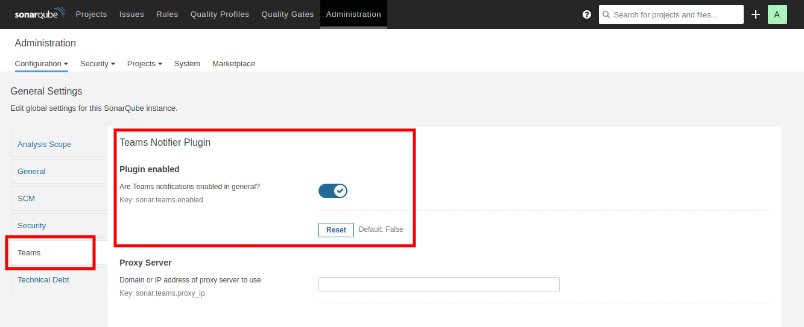

# Sonar Teams Notifier

[](LICENSE)
[](https://travis-ci.com/aensley/sonar-teams-notifier)
[](https://github.com/aensley/sonar-teams-notifier/issues)
[](https://github.com/aensley/sonar-teams-notifier/releases)

This SonarQube plugin notifies WebEx Teams of Scan Results.


## Usage


### Administration

Only one setting is required once the plugin is installed, and that's to enable the plugin.

[](docs/sonar-teams-admin.png)


### Scanning

To enable WebEx Teams notifications for scan results, supply the [**Incoming Webhook URL**](https://apphub.webex.com/integrations/incoming-webhooks-cisco-systems) to the sonar-scanner command using the custom `sonar.teams.hook` property.


```ShellSession
mvn sonar:sonar \
  -Dsonar.teams.hook=https://api.ciscospark.com/v1/webhooks/incoming/1234
```

If you want notifications only of failures, specify any truthy value to the custom `sonar.teams.fail_only` property.

```ShellSession
mvn sonar:sonar \
  -Dsonar.teams.hook=https://api.ciscospark.com/v1/webhooks/incoming/1234 \
  -Dsonar.teams.fail_only=1
```
